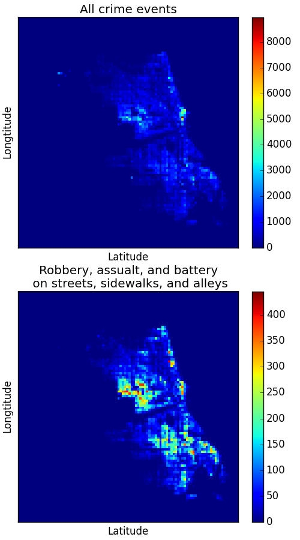

Not all the crime events are related to walking safety in a neighborhood.

The upper panel shows the spatial distribution of all the reported crime events in Chicago.

The lower panel shows the distribution of the crime events closely related to walking safety. These events are robbery, assault, and battery on streets, sidewalks, and alleys.

The data (crime data of Chicago) are from https://data.cityofchicago.org/Public-Safety/Crimes-2001-to-present/ijzp-q8t2.

