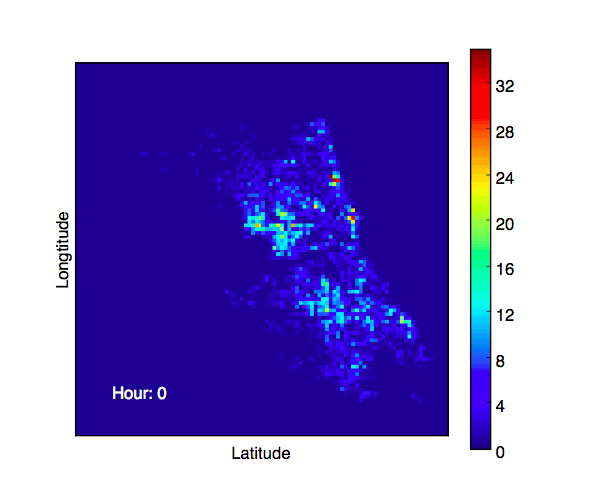

Walking safety highly depends on time.
The following animation shows how the distribution of crime events varies with time in a day.

Only robbery, assault, and battery on streets, sidewalks, and alleys are considered. 
The data (crime data of Chicago) are from https://data.cityofchicago.org/Public-Safety/Crimes-2001-to-present/ijzp-q8t2.

